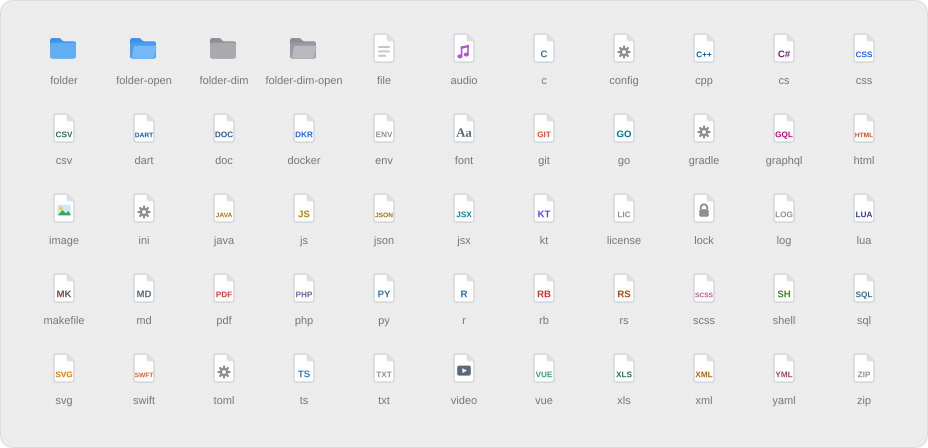
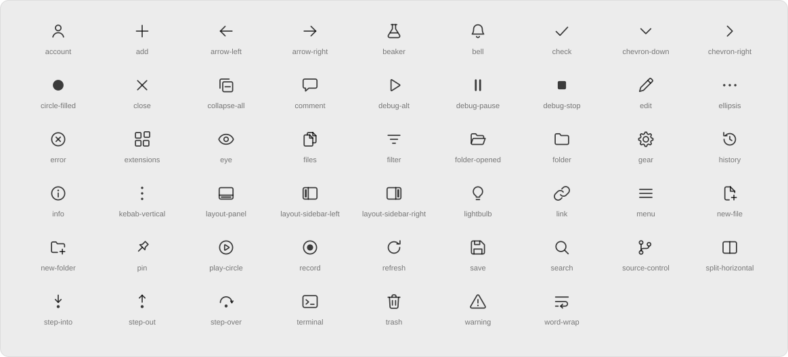

# macOS 27 Skin for VS Code

macOS-faithful color themes (dark and light, made for the Vibrancy Continued\nextension), an
SF-Symbol-style file icon theme, and a matching product icon theme.

---

### File icons

56 icons for folders and common file types, drawn on a 16pt grid.

<picture>
  <source media="(prefers-color-scheme: dark)" srcset="images/file-icons-dark.svg">
  
</picture>

### Product icons

SF-style glyphs replace VS Code's activity bar, toolbar and debug icons.

<picture>
  <source media="(prefers-color-scheme: dark)" srcset="images/product-icons-dark.svg">
  
</picture>

---

## Folder structure

```
macos-27-skin/
├── package.json                    # extension manifest (registers all themes)
├── README.md
├── themes/
│   ├── macos-dark.json             # color theme: macOS Dark
│   └── macos-light.json            # color theme: macOS Light
├── fileicons/
│   ├── icon-theme.json             # file icon theme: extension/filename -> SVG map
│   └── icons/                      # 56 SVGs (16pt grid)
│       ├── _file.svg, _file_light.svg
│       ├── folder.svg, folder-open.svg, folder-dim.svg, folder-dim-open.svg
│       └── audio.svg, c.svg, cpp.svg, css.svg, js.svg, py.svg, ts.svg, …
└── producticons/
    ├── product-icon-theme.json     # product icon theme: VS Code icon id -> glyph
    ├── sficons.ttf                 # compiled icon font (U+E001–U+E036)
    └── svg/                        # 54 source glyphs (24pt grid, 1.5pt stroke)
        └── account.svg, files.svg, gear.svg, search.svg, source-control.svg, …
```

Keep the folder as-is: `package.json` must sit directly inside `macos-27-skin/`.

---

## 1. Install the extension

The extensions folder is hidden by default. Open it directly:

**macOS**
1. In Finder, press `Cmd+Shift+G` (Go > Go to Folder…).
2. Paste `~/.vscode/extensions` and press Return.
3. Drag the `macos-27-skin` folder into the window that opens.

Or in Terminal: `cp -R ~/Downloads/macos-27-skin ~/.vscode/extensions/`

**Windows**
1. Press `Win+R`.
2. Paste `%USERPROFILE%\.vscode\extensions` and press Enter.
3. Drag the `macos-27-skin` folder into the Explorer window that opens.

**Linux**
In Terminal: `cp -R ~/Downloads/macos-27-skin ~/.vscode/extensions/`

The result should look like this:

```
extensions/
├── macos-27-skin/
│   ├── package.json
│   ├── themes/
│   ├── fileicons/
│   └── producticons/
└── (your other extensions…)
```

Not `extensions/macos-27-skin/macos-27-skin/package.json`. Unzipping sometimes
adds an extra folder level, so check for this if the theme doesn't appear.

Quit VS Code fully (`Cmd+Q` / close all windows) and reopen it.

## 2. Activate the three themes

Installing alone changes nothing — each theme has to be selected. Open the
Command Palette (`Cmd+Shift+P` / `Ctrl+Shift+P`) and run:

| Command | Pick |
|---|---|
| Preferences: Color Theme | **macOS Dark** or **macOS Light** |
| Preferences: File Icon Theme | **macOS SF-Style Icons** |
| Preferences: Product Icon Theme | **macOS SF-Style Product Icons** |

Or set all three at once in `settings.json`:

```json
"workbench.colorTheme": "macOS Dark",
"workbench.iconTheme": "macos-sf-icons",
"workbench.productIconTheme": "macos-sf-product-icons"
```

---

## Required plugin — Vibrancy Continued

**macOS Dark** and **macOS Light** are built to run with the Vibrancy Continued
extension. VS Code windows are opaque by default, so a color theme cannot show
the desktop through the window chrome on its own.

1. Install **Vibrancy Continued** — `illixion.vscode-vibrancy-continued`
   (Extensions view -> search "Vibrancy Continued", or
   `code --install-extension illixion.vscode-vibrancy-continued`).
2. Add to `settings.json`:

```json
"window.titleBarStyle": "custom",
"vscode_vibrancy.type": "sidebar",
"vscode_vibrancy.opacity": -1
```

3. Run **Reload Vibrancy** from the Command Palette. VS Code will warn that the
   installation is corrupt — this is expected; Vibrancy patches the app shell.
   Click the gear on the notification and choose "Don't Show Again".
4. Re-run **Reload Vibrancy** after every VS Code update, or the effect is lost.

Only the chrome is translucent: title bar, activity bar, sidebar, tab strip,
and status bar. The editor, gutter, minimap, breadcrumbs, panel, and terminal
stay solid so code never sits on top of the desktop. Without the extension the
themes still work, just with an opaque window.

Vibrancy is macOS only. On Windows/Linux, Vibrancy Continued offers acrylic
effects but results vary.

---

## Recommended settings

Optional, but the skin was designed against these:

```json
"window.titleBarStyle": "custom",
"window.commandCenter": false,
"editor.fontFamily": "SF Mono, Menlo, monospace",
"editor.fontSize": 13,
"editor.lineHeight": 20,
"workbench.tree.indent": 12,
"workbench.editor.tabSizing": "shrink",
"breadcrumbs.enabled": false
```

`window.titleBarStyle: "custom"` is what lets the theme color the title bar.
With `"native"` the title bar stays system-gray and Vibrancy will not work.

### Auto light/dark switching

```json
"window.autoDetectColorScheme": true,
"workbench.preferredDarkColorTheme": "macOS Dark",
"workbench.preferredLightColorTheme": "macOS Light"
```

---

## Customizing

- **Syntax colors** — replace the `tokenColors` array in
  `themes/macos-dark.json` / `macos-light.json`.
- **Product icons** — 54 glyphs at `U+E001`–`U+E036` cover 96 VS Code icon ids;
  anything not overridden falls back to the stock set. Source artwork is in
  `producticons/svg/` (24pt grid, 1.5pt stroke) and is outlined into
  `sficons.ttf`. Edit an SVG there to redraw a glyph.
- **File icons** — add or swap SVGs in `fileicons/icons/` and map them in
  `fileicons/icon-theme.json`.

No Apple fonts or assets are redistributed; all glyphs are drawn from scratch.

## Troubleshooting

- **Icons didn't change** — the file and product icon themes are separate
  settings from the color theme. Both must be selected.
- **Title bar is the wrong color** — set `"window.titleBarStyle": "custom"` and
  restart (not just reload).
- **Vibrancy stopped working** — re-run **Reload Vibrancy** after a VS Code
  update.
- **Theme not listed** — the folder must sit directly in `.vscode/extensions/`
  with `package.json` at its root, then VS Code fully restarted.
